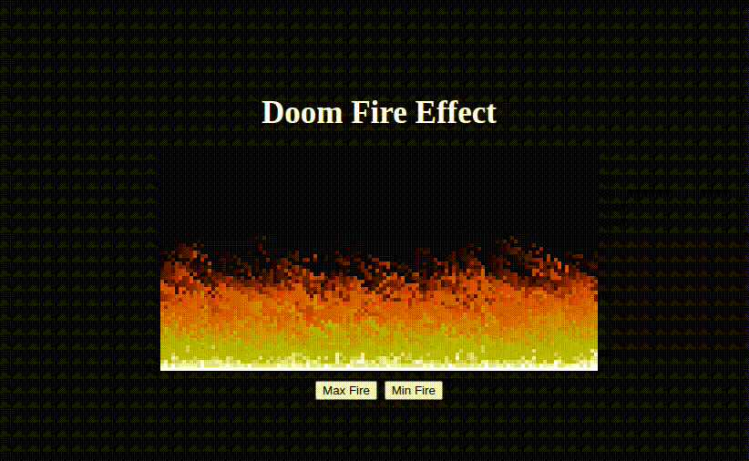

# 🔥 Doom Fire Algorithm
 
Efeito de fogo do jogo *DOOM* (PlayStation) feito com JavaScript puro, renderizado no navegador.


 
## Como funciona
 
Uma grade de pixels guarda a intensidade do fogo (de 0 a 36). A última linha é a fonte, com intensidade máxima, e a cada 50 ms cada pixel copia o valor do pixel abaixo com um pequeno decaimento aleatório. Cada intensidade corresponde a uma cor da paleta, do preto ao branco.
 
## Como executar
 
```bash
git clone https://github.com/AislanSL/doom-fire-algorith.git
```
 
Depois, abra o arquivo `index.html` no navegador.
 
## Controles
 
- **Max Fire:** acende o fogo
- **Min Fire:** apaga o fogo gradualmente
## Autor
 
[@AislanSL](https://github.com/AislanSL)